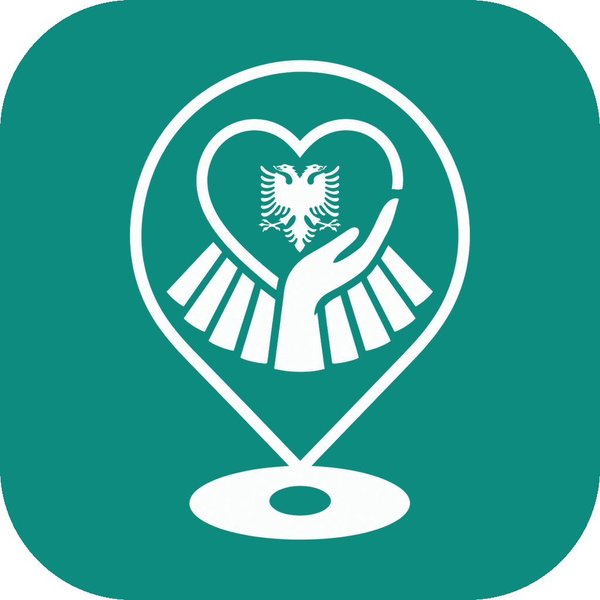

# Vitalis

When someone collapses, Vitalis calls the nearest certified responder, sends a second one for the closest defibrillator, and coaches the caller through CPR until help arrives. Dispatchers watch every call, responder and AED live; a drone can be dispatched from the same console.

Built for Tirana first. Emergency numbers: ambulance **127**, general **112**.

## The parts

| Part | Folder | Who uses it | Run |
|---|---|---|---|
| Mobile app | [`apps/native`](apps/native/README.md) (Expo, iOS + Android) | Citizens and responders | `npm run dev:native` |
| Watch apps | [`apps/watch`](apps/watch/README.md) (Wear OS + Apple Watch) | Citizens: SOS and heart check from the wrist | see [`apps/watch`](apps/watch/README.md) |
| Desktop console | [`apps/desktop`](apps/desktop/README.md) (React + Tauri shell) | Dispatchers and admins | `npm run dev:desktop` → :5173 |
| Website | `apps/landing` | Public: download links, certificate check | `npm run dev:landing` → :5175 |
| Drones | `apps/drone` | Runs next to the drone | `npm run dev:drone` |

All of them talk to one API: [`apps/api`](apps/api/README.md) (Express, MongoDB, Socket.io) on :4000.

## How an SOS works

1. Caller taps SOS. A 3-second countdown allows cancelling; "someone isn't breathing" marks it as a cardiac arrest.
2. The API alerts on-duty responders within 5 km (20 km if nobody is closer). Only doctors, nurses and people with a valid CPR/AED certificate can go on duty.
3. First to accept gets the patient. On a cardiac arrest the second gets sent to the nearest registered AED first.
4. The caller sees who is coming and how far away, gets a 110/min CPR metronome, and a one-tap ambulance call.
5. The responder opens a handover summary (allergies, medication, conditions, timeline) for the ambulance crew.
6. The console shows it all live and flags calls with no responder after 60 seconds.

Taking the CPR or AED course in the app turns a citizen into a responder.

## Logo and app icons

`brand/logo-source.png` is the logo as designed. `python3 scripts/brand-assets.py` builds every icon and logo file from it (app icons for iOS, Android, both watches and the desktop installers, favicons, in-app tiles) and writes them where each app expects them. After changing the logo, run it, then the `npx tauri icon` line it prints in its header, and commit the results.

## Getting started

Requirements: Node 20+, MongoDB running locally (or `docker compose up mongo`).

```bash
cp .env.example .env          # set JWT_ACCESS / JWT_REFRESH (32+ chars) at least
npm install
npm run seed                  # wipes the DB and loads demo data (refuses in production)
npm run dev:api
npm run dev:desktop           # console in the browser
npm run dev:landing           # website
npm run dev:native            # mobile, scan the QR with Expo Go
```

On a physical phone set `EXPO_PUBLIC_API_URL=http://<your-laptop-LAN-ip>:4000/api`.

### Demo accounts (from `npm run seed`)

| Email | Password | Role |
|---|---|---|
| `demo@vitalis.com` | `Demo1234!` | citizen (mobile) |
| `doctor@vitalis.com` | `Doctor1!` | doctor (mobile, responder inbox) |
| `nurse@vitalis.com` | `Nurse1!` | nurse (mobile, responder inbox) |
| `aleks@vitalis.com` | see seed | emergency services operator (ESO): runs the console and administers it |

Change these before any real deployment. The console only shows demo-account shortcuts in development builds.

## Drones (DJI Tello)

The bridge runs on a laptop joined to the Tello's Wi-Fi and stays online through a second link (USB Wi-Fi adapter, Ethernet, or a phone over USB).

```bash
# same DRONE_BRIDGE_KEY on the API and the bridge (openssl rand -hex 24)
DRONE_BRIDGE_KEY=... API_URL=http://<api>:4000 npm run dev:drone
npm run dev:drone:sim          # simulated Tello, no hardware needed
brew install ffmpeg            # optional: live camera in the console
```

The Tello has no GPS, so autonomous routes are measured moves from the take-off spot (`forward 200`, `cw 90`, …). Manual flight uses W A S D and the arrow keys in the console. Safety rules run on the bridge itself: no take-off under 30% battery, land if the API link drops, hover when you let go of the controls, land after 60 s without input.

## Watch apps

`apps/watch` holds the Wear OS app (`wearos/`, Kotlin) and the Apple Watch app (`watchos/`, Swift). Both have the same screens, rules and design: hold-to-SOS with a 3-second cancel, the SOS's live status, Call 127, the Medical ID, and a background heart check that asks "Are you OK?" and sends an SOS if nobody answers. A watch pairs with a 6-digit code typed in the phone app (Profile → Watch) and gets a key limited to its own SOS and Medical ID. Spec, build steps and the shared rules: [`apps/watch/README.md`](apps/watch/README.md).

## Desktop app

`apps/desktop/src-tauri` wraps the console as an installable app. Install Rust once (`curl https://sh.rustup.rs -sSf | sh`), then:

```bash
npm run desktop:build -w @vitalis/desktop    # .dmg / .app on macOS, .msi / .exe on Windows
```

Set `VITE_API_URL` and `VITE_SOCKET_URL` to your production API before building.

## Checks

With the API running against a seeded test database:

```bash
API_URL=http://localhost:4000 npm run check:security   # auth, RBAC, injection, dispatch races, rooms
API_URL=http://localhost:4000 npm run check:drones     # needs the bridge in sim mode
```

## Deploying the website

`apps/landing` is a static build (`npm run build -w @vitalis/landing`). Configure the host to serve `index.html` for `/verify/*` so certificate QR codes work, and set `PUBLIC_WEB_URL` on the API to the site's origin. Set `VITE_APP_STORE_URL` / `VITE_PLAY_STORE_URL` once the apps are published; until then the buttons read "Coming soon".

## Running the API in production

`docker compose up -d` starts MongoDB (loopback only), the API (`NODE_ENV=production`, Docker health check on `/health`), the console and a nightly backup.

- **Secrets** go in a `.env` next to `docker-compose.yml`: `JWT_ACCESS`, `JWT_REFRESH` (`openssl rand -hex 32` each), `CORS_ORIGIN`, `PUBLIC_WEB_URL`, the `TWILIO_*` values, `GEMINI_API_KEY`, `DRONE_BRIDGE_KEY`.
- **Backups**: one gzip dump a day in `./backups`, 14 days kept. Copy that folder off the server too (a backup on the same disk dies with it). Restore: `docker compose exec -T mongo mongorestore --gzip --archive --drop < backups/vitalis-YYYY-MM-DD.gz`.
- **Road ETAs**: `scripts/osrm-prepare.sh` builds the Albania road map once, then `docker compose --profile osrm up -d osrm` and `OSRM_URL=http://osrm:5000`. Without it, ETAs fall back to straight-line estimates; the public OSRM demo is never used in production.
- **Uptime**: point a monitor (e.g. UptimeRobot's free plan) at `https://<api>/health`. It returns 503 when the database is down, so an alert fires for a dead database as well as a dead server.
- Put HTTPS in front (Caddy or the host's load balancer). Push, SMS and the tracking link all assume it.
